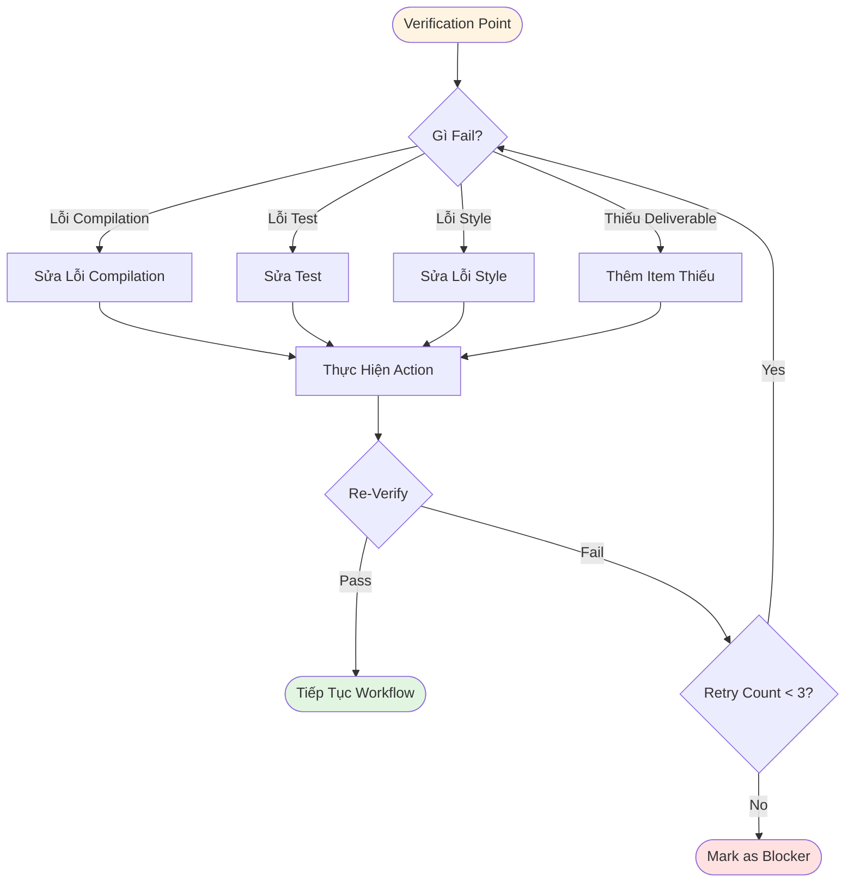
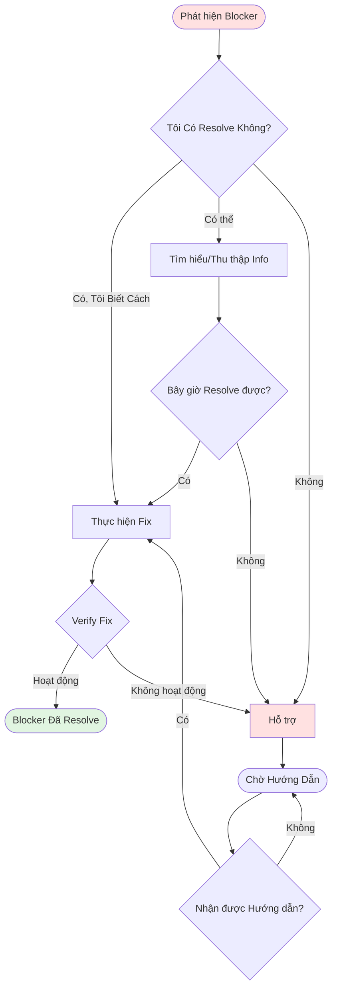

# BHXH Backend - Quy Trình Phát Triển Chi Tiết

## Mục Lục
- [1. Bảng Tổng Quan Workflow](#1-bảng-tổng-quan-workflow)
- [2. Sơ Đồ Dòng Chảy Workflow](#2-sơ-đồ-dòng-chảy-workflow)
- [3. Tóm Tắt Tham Khảo Nhanh](#3-tóm-tắt-tham-khảo-nhanh)
- [4. Workflow Chi Tiết](#4-workflow-chi-tiết)
- [5. Quy Tắc Chung (Universal Rules)](#5-quy-tắc-chung-universal-rules)
- [6. Cây Quyết Định & Workflow](#6-cây-quyết-định--workflow)
- [7. Tham Khảo](#7-tham-khảo)

---

## 1. Bảng Tổng Quan Workflow

| Phase | Tên | Mục Đích | Input | Output | Tiêu Chuẩn Thành Công |
|-------|-----|----------|-------|--------|------------------------|
| 1 | Brainstorming | Hiểu yêu cầu & thiết kế giải pháp | Project Context, User requirements | Đề xuất thiết kế | Được stakeholder phê duyệt |
| 2 | Acceptance Criteria | Định nghĩa yêu cầu có thể test được | Đề xuất thiết kế | Tài liệu Checklist QC | Hoàn thành 11 sections |
| 3 | PAKT | Định nghĩa giải pháp kỹ thuật | Checklist QC | Tài liệu PAKT | Review kỹ thuật vượt qua |
| 4 | Task Breaking | Phân nhỏ cho AI thực thi | Tài liệu PAKT | Files giải pháp task | Định nghĩa tất cả tasks |
| 5 | AI Generate Code | Triển khai giải pháp | Task files | Mã nguồn | Tất cả tests pass |
| 6 | Fix & Improve | Đảm bảo chất lượng | Mã nguồn | Code đã test, sạch | Lint và typecheck pass |
| 7 | Update Docs | Hoàn thiện tài liệu | Tất cả artifacts | PAKT, Checklist đã cập nhật | Tài liệu hoàn chỉnh |

---

## 2. Sơ Đồ Dòng Chảy Workflow

```
                                 ┌─────────────────────────────┐
                                 │      Bắt Đầu Phát Triển     │
                                 │  Input: Yêu cầu,            │
                                 │         Context             │
                                 └──────────────┬──────────────┘
                                                │
                                                ▼
                                 ┌─────────────────────────────┐
                                 │   Phase 1: Brainstorming    │
                                 ├─────────────────────────────┤
                                 │ • Đọc Project Context       │
                                 │ • Sử dụng Brainstorming     │
                                 │   Skill                     │
                                 │ • Làm rõ yêu cầu            │
                                 │ • Xác thực sự hiểu biết     │
                                 │ • Trình bày thiết kế        │
                                 ├─────────────────────────────┤
                                 │ Output: Đề xuất thiết kế    │
                                 └──────────────┬──────────────┘
                                                │
                                     ┌──────────┴──────────┐
                                     │ Đã phê duyệt?       │
                                     └──────────┬──────────┘
                               ┌───────────┴───────────┐
                               │ CÓ                    │ KHÔNG
                               ▼                       ▼
                     ┌───────────────────┐    ┌──────────────────┐
                     │  Phase 2:         │    │  Quay lại        │
                     │  Acceptance       │    │  Phase 1         │
                     │  Criteria         │    └──────────────────┘
                     ├───────────────────┤
                     │ • Đọc Checklist   │
                     │   Rule            │
                     │ • Tạo 11 sections │
                     │ • Kiểm tra        │
                     │   tính đầy đủ     │
                     │ • Kiểm tra chất   │
                     │   lượng           │
                     ├───────────────────┤
                     │ Output:           │
                     │ checklist_qc.md   │
                     └─────────┬─────────┘
                               │
                        ┌──────┴────────┐
                        │ Đã hoàn thành │
                        │ 11 sections?  │
                        └────────┬──────┘
                  ┌──────────────┴──────────────┐
                  │ CÓ                          │ KHÔNG
                  ▼                             ▼
        ┌───────────────────┐         ┌──────────────────┐
        │  Phase 3:         │         │  Quay lại        │
        │  PAKT             │         │  Phase 2         │
        ├───────────────────┤         └──────────────────┘
        │ • Đọc PAKT Rule   │
        │ • Tạo 10 sections │
        │ • Map checklist   │
        │ • Định nghĩa arch/│
        │   API/data        │
        ├───────────────────┤
        │ Output:           │
        │ pakt_{feature}.md │
        └─────────┬─────────┘
                  │
           ┌──────┴────────┐
           │ Review kỹ     │
           │ thuật pass?   │
           └──────┬────────┘
     ┌────────────┴──────────────┐
     │ CÓ                        │ KHÔNG
     ▼                           ▼
   ┌───────────────────┐    ┌──────────────────┐
   │  Phase 4:         │    │  Quay lại        │
   │  Task Breaking    │    │  Phase 3         │
   ├───────────────────┤    └──────────────────┘
   │ • Đọc Tasks Rule  │
   │ • Phân tích PAKT  │
   │ • Tạo task files   │
   │ • Thêm code       │
   │   references      │
   ├───────────────────┤
   │ Output:           │
   │ task_{XX}.md      │
   └─────────┬─────────┘
             │
      ┌──────┴────────┐
      │ Tất cả Tasks  │
      │ đã định nghĩa?│
      └──────┬────────┘
    ┌────────┴────────────────────┐
    │ CÓ                          │ KHÔNG
    ▼                             ▼
  ┌───────────────────┐    ┌──────────────────┐
  │  Phase 5:         │    │  Quay lại        │
  │  AI Generate      │    │  Phase 4         │
  │  Code             │    └──────────────────┘
  ├───────────────────┤
  │ • Đọc Executing   │
  │   Plans Skill     │
  │ • Load tasks      │
  │ • Execute batches │
  │ • Verify từng cái │
  ├───────────────────┤
  │ Output:           │
  │ Source Code       │
  └─────────┬─────────┘
            │
     ┌──────┴───────┐
     │ Bị block?    │
     └──────┬───────┘
   ┌────────┴────────────────────┐
   │ KHÔNG                       │ CÓ
   ▼                             ▼
 ┌──────────────────┐    ┌──────────────────┐
 │  Phase 6:        │    │  Có thể giải     │
 │  Fix & Improve   │    │  quyết không?    │
 ├──────────────────┤    └────────┬─────────┘
 │ • ./mvnw clean   │    ┌────────┴──────────┐
 │   compile        │    │ CÓ    │ KHÔNG     │
 │ • ./mvnw test    │    ▼        ▼          │
 │ • Kiểm tra style │  ┌──────┐ ┌──────┐     │
 │ • Kiểm tra       │  │Quay  │ │Escal-│     │
 │   security       │  │lại P5│ │ate   │     │
 ├──────────────────┤  └──────┘ └──────┘     │
 │ Output: Code     │                        │
 │   đã test, sạch  │                        │
 └─────────┬────────┘                        │
           │                                 │
    ┌──────┴────────┐                        │
    │ Tất cả checks │                        │
    │ pass?         │                        │
    └──────┬────────┘                        │
  ┌────────┴─────────────────────┐           │
  │ CÓ                           │ KHÔNG     │
  ▼                              │           │ 
 ┌───────────────────┐           │           │
 │  Phase 7:         │           │           │
 │  Update Docs      │           │           │
 ├───────────────────┤           │           │
 │ • Update PAKT     │           │           │
 │ • Update Checklist│           │           │
 │ • Báo cáo tổng    │           │           │
 ├───────────────────┤           │           │
 │ Output: Tài liệu  │           │           │
 │   hoàn chỉnh      │           │           │
 └─────────┬─────────┘           │           │
           │                     │           │
           │                     └───────────┘
           ▼
    ┌──────────────────┐
    │ ✅ Feature       │
    │    Hoàn Thành    │
    │ • Code compiles  │
    │ • Tests pass     │
    │ • Docs updated   │
    └──────────────────┘
```

---

## 3. Tóm Tắt Tham Khảo Nhanh

### Phase 1: Brainstorming
**Mô tả**: Hiểu sâu yêu cầu và thiết kế giải pháp đáp ứng nhu cầu stakeholder.
- Đọc [Project Context](../context/context.md) để hiểu kiến trúc hệ thống
- Xem lại [AGENTS.md](../AGENTS.md) để nắm coding guidelines
- Sử dụng [Brainstorming Skill](../.agent/skills/brainstorming/SKILL.md)
- Làm rõ yêu cầu (edge cases, permissions, integrations, data model, state transitions)
- Xác thực sự hiểu với stakeholders
- Trình bày đề xuất thiết kế ban đầu

**Output chính**: Đề xuất thiết kế được stakeholder phê duyệt

---

### Phase 2: Acceptance Criteria Checklist
**Mô tả**: Tạo requirements có thể test được, bao quát mọi kịch bản.
- Đọc [Create Checklist Rule](rule_create_checklist.md)
- Tạo `docs/tasks/checklist_qc_{app|portal}_{featurename}.md`
- Hoàn thành 11 sections:
  - Happy Paths (100% bao phủ)
  - Common Scenarios (50-70% bao phủ)
  - Validations
  - Business Rules
  - State Management
  - Error Handling
  - Edge Cases
  - Permissions
  - External Integrations
  - Non-Functional Requirements
  - Definition of Done
- Kiểm tra tính đầy đủ và chất lượng

**Output chính**: `checklist_qc_{app|portal}_{feature}.md` hoàn thành 11 sections

---

### Phase 3: PAKT - Giải Pháp Kỹ Thuật
**Mô tả**: Định nghĩa giải pháp kỹ thuật toàn diện bao phủ mọi khía cạnh implementation.
- Đọc [Create PAKT Rule](rule_create_pakt.md)
- Tạo `pakt/pakt_{app|portal}_{featurename}.md`
- Hoàn thành 10 sections:
  - Scope
  - Mapping Checklist to Solution
  - Architecture
  - API Design
  - Data Model
  - Business Logic
  - Integration
  - Security
  - Impact Analysis
  - Implementation Notes
- Map mọi checklist items sang cách tiếp cận kỹ thuật
- Theo code style từ [AGENTS.md](../AGENTS.md)
- **Quan trọng**: FK đến `dm_*` tables phải reference column `ma`, KHÔNG PHẢI `id`

**Output chính**: `pakt_{app|portal}_{feature}.md` hoàn thành 10 sections

---

### Phase 4: Task Breaking
**Mô tả**: Phân nhỏ PAKT thành tasks executable cho AI code generation.
- Đọc [Break Tasks from PAKT Rule](rule_break_tasks_from_pakt.md)
- Phân tích PAKT để xác định work packages
- Tạo task files: `pakt/{feature}/task_{XX}_{name}_solution.md`
- Định nghĩa tasks:
  - **Task 00**: Data Model (entities, repositories, FK mappings với `referencedColumnName = "ma"`)
  - **Task 01+**: API Layer (controllers, DTOs, MapStruct, `@PreAuthorize`)
  - **Task 02+**: Business Logic (services, state machine, events, `@Transactional`)
  - **Task 03+**: Integration (WebClient, external APIs, timeout/retry)
- Thêm code references từ codebase hiện có
- Document dependencies giữa các tasks

**Output chính**: Files `task_{XX}_{name}_solution.md` kèm code references

---

### Phase 5: AI Generate Code
**Mô tả**: Thực thi tasks và sinh production code.
- Đọc [Executing Plans Skill](../.agent/skills/executing-plans/SKILL.md)
- Load tất cả task plans từ `pakt/{feature}/`
- Thực thi tasks theo batches (mỗi batch 3 tasks)
- Verify sau mỗi batch:
  - Chạy `./mvnw clean compile`
  - Kiểm tra code theo [AGENTS.md](../AGENTS.md)
  - Verify tất cả deliverables có đầy đủ
- Xử lý verification failures (sửa, verify lại)
- Xử lý blockers (cố gắng resolve, escalate nếu cần)

**Output chính**: Source code implementation có thể compile được

---

### Phase 6: Fix & Improve
**Mô tả**: Đảm bảo chất lượng code, fix issues, verify correctness.
- Chạy compilation: `./mvnw clean compile`
- Chạy tests: `./mvnw test` (nếu có)
- Kiểm tra code style theo [AGENTS.md](../AGENTS.md):
  - Tổ chức imports (Java stdlib → Third-party → Project)
  - Naming conventions (PascalCase classes, camelCase methods, Vietnamese cho business logic)
  - Lombok annotations (DTOs: `@Data`, Entities: `@Getter/@Setter`, Services: `@RequiredArgsConstructor @Slf4j`)
  - Entity mapping (`@Table`, `@Column` với snake_case, FK đến `dm_*` dùng `referencedColumnName = "ma"`)
  - API layer (CMS: `/api/v1/**` với `@PreAuthorize`, App: `/api/app/v1/**` với `@authenticated`)
  - Error handling (`BusinessException` với `MessageResponseDict`)
  - Logging (`@Slf4j`, format: `log.info("Action: id={}, status={}", id, status)`)
- Review code quality (transactions, validation, null safety, error handling)
- Review security (permissions, authentication, SQL injection, secrets)
- Verify build cuối cùng

**Output chính**: Code sạch, đã test, compile được và pass tất cả checks

---

### Phase 7: Update Final Documents
**Mô tả**: Hoàn thiện tài liệu với status implementation và kết quả verification.
- Update tài liệu PAKT với implementation status:
  - Mark sections: ✅ Implemented, ⚠️ Partial, ❌ Not implemented
  - Document các deviations từ plan gốc
  - Thêm các quyết định kỹ thuật đã đưa ra
- Update tài liệu Checklist với kết quả verification:
  - Mark criteria: ✅ Pass, ⚠️ Partial, ❌ Fail, N/A
  - Thêm bằng chứng verification (test cases, manual testing, code review)
  - Document các gaps hoặc known issues
- Tạo báo cáo tổng hợp (feature summary, status, results, issues, recommendations)
- Review cuối cùng (completeness, consistency, không còn TODOs)

**Output chính**: Package tài liệu hoàn chỉnh (PAKT, Checklist đã update, summary)

---

## 4. Workflow Chi Tiết

### Phase 1: Brainstorming

**Mục đích**: Hiểu sâu yêu cầu và thiết kế giải pháp đáp ứng nhu cầu stakeholder.

**Điều kiện tiên quyết**: Không (điểm bắt đầu)

**Inputs**:
- [Project Context](../context/context.md)
- Tài liệu yêu cầu người dùng
- Các đặc tả feature hiện có (nếu có)

**Outputs**:
- Tài liệu đề xuất thiết kế
- Danh sách yêu cầu đã làm rõ
- Định nghĩa scope ban đầu

**Các bước chi tiết**:

1. **Khởi tạo Context**
   - Đọc [Project Context](../context/context.md) để hiểu kiến trúc hệ thống
   - Xem lại [AGENTS.md](../AGENTS.md) để nắm coding guidelines
   - Xác định các features liên quan và patterns hiện có

2. **Hiểu Ý tưởng**
   - Sử dụng [Brainstorming Skill](../.agent/skills/brainstorming/SKILL.md)
   - Đọc tài liệu yêu cầu người dùng cẩn thận
   - Xác định yêu cầu nghiệp vụ cốt lõi
   - Liệt kê tất cả entities, relationships, và workflows

3. **Làm rõ yêu cầu**
   - Xác định các điểm mơ hồ trong yêu cầu
   - Đặt câu hỏi về:
     - Edge cases và error scenarios
     - Yêu cầu permissions (CMS vs App)
     - External integrations cần thiết
     - Relationships data model
     - State transitions (nếu có)
   - Document tất cả các làm rõ đã nhận

4. **Xác thực sự hiểu biết**
   - Tóm tắt lại sự hiểu cho stakeholders
   - Xác nhận business rules và constraints
   - Verify scope boundaries (những gì trong/ngoài scope)
   - Nhận xác nhận trên các quyết định quan trọng

5. **Trình bày thiết kế**
   - Trình bày đề xuất thiết kế ban đầu
   - Bao gồm:
     - Kiến trúc high-level
     - Các components chính và trách nhiệm của chúng
     - Tổng quan data model
     - Đề xuất API endpoints
     - Integration points
   - Giải đáp các mối quan ngại và iterate

**Tiêu chuẩn thành công**:
- [ ] Stakeholder phê duyệt đề xuất thiết kế
- [ ] Tất cả câu hỏi quan trọng đã được trả lời
- [ ] Scope boundaries được định nghĩa rõ
- [ ] Business rules được document
- [ ] Không còn ambiguities lớn

**Rules liên quan**:
- [Brainstorming Skill](../.agent/skills/brainstorming/SKILL.md)
- [Code Style Guidelines](../AGENTS.md)

**Các lỗi thường gặp**:
- ❌ Bỏ qua bước làm rõ và tự đặt giả định
- ❌ Không kiểm tra patterns hiện có trong codebase
- ❌ Thiết kế mà không xem xét permissions (CMS vs App)
- ❌ Quên hỏi về external integrations

---

### Phase 2: Acceptance Criteria Checklist

**Mục đích**: Tạo requirements toàn diện có thể test được bao phủ mọi scenarios.

**Điều kiện tiên quyết**: Phase 1 hoàn thành (thiết kế được phê duyệt)

**Inputs**:
- Đề xuất thiết kế đã phê duyệt
- [Create Checklist Rule](rule_create_checklist.md)

**Outputs**:
- `docs/tasks/checklist_qc_{app|portal}_{featurename}.md`

**Các bước chi tiết**:

1. **Đọc Create Checklist Rule**
   - Nghiên cứu [rule_create_checklist.md](rule_create_checklist.md)
   - Hiểu cấu trúc 11 sections
   - Xem các ví dụ nếu có

2. **Tạo tài liệu Checklist**
   - Tạo file: `docs/tasks/checklist_qc_{app|portal}_{featurename}.md`
   - Hoàn thành 11 sections:
     
     **Section 1: Happy Paths - 100% Coverage**
     - Main success scenarios
     - Tất cả permutations của valid inputs
     - Complete user journeys
     
     **Section 2: Common Scenarios - 50-70% Coverage**
     - Typical user behaviors
     - Use cases thường gặp nhất
     - Expected partial failures
     
     **Section 3: Validations**
     - Input field validations
     - Business rule validations
     - Permission checks
     
     **Section 4: Business Rules**
     - Calculations và formulas
     - State transition rules
     - Constraints và invariants
     
     **Section 5: State Management**
     - Initial states
     - State transitions (nếu có)
     - State queries
     
     **Section 6: Error Handling**
     - Expected error scenarios
     - Error codes và messages
     - Recovery behaviors
     
     **Section 7: Edge Cases**
     - Boundary conditions
     - Empty/Null scenarios
     - Concurrent operations
     
     **Section 8: Permissions**
     - CMS permission requirements
     - App authentication requirements
     - Cross-user access rules
     
     **Section 9: External Integrations**
     - External API calls
     - Timeout scenarios
     - Retry behaviors
     
     **Section 10: Non-Functional**
     - Performance requirements
     - Caching strategy
     - Logging requirements
     
     **Section 11: Definition of Done**
     - Code complete
     - Tests passing
     - Documentation updated
     - Code review complete

3. **Verify Completeness**
   - Kiểm tra tất cả sections đã điền
   - Đảm bảo happy paths bao phủ 100%
   - Đảm bảo common scenarios bao phủ 50-70%
   - Verify tất cả error codes đã định nghĩa

4. **Quality Check**
   - Review để đảm bảo clarity
   - Đảm bảo testability (mỗi criterion phải verifiable)
   - Kiểm tra traceability đến requirements

**Tiêu chuẩn thành công**:
- [ ] Hoàn thành tất cả 11 sections
- [ ] Happy paths document với 100% coverage
- [ ] Common scenarios document (50-70% coverage)
- [ ] Mọi criterion đều có thể test được
- [ ] Error codes được định nghĩa
- [ ] DoD định nghĩa rõ
- [ ] Không bỏ sót critical scenarios nào

**Rules liên quan**:
- [Create Checklist Rule](rule_create_checklist.md)

**Các lỗi thường gặp**:
- ❌ Bỏ sót edge cases (null checks, empty lists)
- ❌ Quên permission scenarios
- ❌ Criteria không thể test (VD: "user-friendly" mà không cụ thể)
- ❌ Bỏ qua error scenarios
- ❌ Không bao phủ state transitions cho workflows

---

### Phase 3: PAKT - Giải Pháp Kỹ Thuật

**Mục đích**: Định nghĩa giải pháp kỹ thuật toàn diện bao phủ mọi khía cạnh implementation.

**Điều kiện tiên quyết**: Phase 2 hoàn thành (checklist được phê duyệt)

**Inputs**:
- Tài liệu checklist đã phê duyệt
- [Create PAKT Rule](rule_create_pakt.md)
- Codebase hiện có để tham khảo

**Outputs**:
- `pakt/pakt_{app|portal}_{featurename}.md`

**Các bước chi tiết**:

1. **Đọc Create PAKT Rule**
   - Nghiên cứu [rule_create_pakt.md](rule_create_pakt.md)
   - Hiểu cấu trúc 10 sections
   - Xem các ví dụ PAKT trong codebase

2. **Tạo tài liệu PAKT**
   - Tạo file: `pakt/pakt_{app|portal}_{featurename}.md`
   - Hoàn thành 10 sections:
     
     **Section 1: Scope**
     - Feature description
     - In-scope items
     - Out-of-scope items
     - Assumptions
     
     **Section 2: Mapping Checklist to Solution**
     - Map từng checklist item sang cách tiếp cận kỹ thuật
     - Reference acceptance criteria IDs
     - Đảm bảo tất cả checklist items được bao phủ
     
     **Section 3: Architecture**
     - Component diagram
     - Layer breakdown (Controller → Service → Repository)
     - Key classes và responsibilities của chúng
     - Design patterns được sử dụng
     
     **Section 4: API Design**
     - Endpoint definitions (CMS: `/api/v1/**`, App: `/api/app/v1/**`)
     - Request/Response DTOs
     - HTTP methods và status codes
     - Swagger annotations
     
     **Section 5: Data Model**
     - Entity definitions với JPA annotations
     - Table relationships (OneToOne, OneToMany, ManyToOne)
     - Foreign key mappings (lưu ý: `dm_*` tables dùng `ma`, không dùng `id`)
     - Indexes và constraints
     
     **Section 6: Business Logic**
     - Service layer methods
     - Algorithms và calculations
     - State machine usage (nếu có)
     - Event publishing cho audit
     
     **Section 7: Integration**
     - External API calls (WebClient)
     - Timeout và retry configurations
     - Error handling cho external calls
     - Data transformation logic
     
     **Section 8: Security**
     - Permission annotations (`@PreAuthorize`)
     - Authentication requirements
     - Input validation
     - Sensitive data handling
     
     **Section 9: Impact Analysis**
     - Breaking changes
     - Database migrations cần thiết
     - Performance considerations
     - Các dependent features bị ảnh hưởng
     
     **Section 10: Implementation Notes**
     - Batch size cho bulk operations (500-600)
     - Caching strategy (Redis, TTL 60min)
     - Transaction boundaries
     - Special considerations

3. **Verify Completeness**
   - Đảm bảo tất cả checklist items được map
   - Kiểm tra tất cả scenarios có pseudocode
   - Verify không có implementation details (giữ ở mức trừu tượng)
   - Review để đảm bảo consistency với patterns trong codebase

**Tiêu chuẩn thành công**:
- [ ] Hoàn thành tất cả 10 sections
- [ ] Mọi checklist items được map sang solution
- [ ] Chỉ có pseudocode (không có implementation thực)
- [ ] Architecture tuân theo patterns hiện có
- [ ] Tất cả scenarios được bao phủ
- [ ] Security considerations được document
- [ ] Database FKs reference đúng column `ma` cho `dm_*` tables

**Rules liên quan**:
- [Create PAKT Rule](rule_create_pakt.md)
- [Code Style Guidelines](../AGENTS.md)

**Các lỗi thường gặp**:
- ❌ Viết implementation code thay vì pseudocode
- ❌ Quên map checklist items
- ❌ FK references sai (dùng `id` thay vì `ma` cho `dm_*` tables)
- ❌ Thiếu permission annotations
- ❌ Không xem xét transaction boundaries
- ❌ Quên external API timeout/retry handling

---

### Phase 4: Task Breaking

**Mục đích**: Phân nhỏ PAKT thành tasks executable cho AI code generation.

**Điều kiện tiên quyết**: Phase 3 hoàn thành (PAKT được phê duyệt)

**Inputs**:
- Tài liệu PAKT đã phê duyệt
- [Break Tasks from PAKT Rule](rule_break_tasks_from_pakt.md)

**Outputs**:
- `pakt/{feature}/task_00_{name}_solution.md`
- `pakt/{feature}/task_01_{name}_solution.md`
- `pakt/{feature}/task_02_{name}_solution.md`
- Additional task files nếu cần

**Các bước chi tiết**:

1. **Đọc Break Tasks Rule**
   - Nghiên cứu [rule_break_tasks_from_pakt.md](rule_break_tasks_from_pakt.md)
   - Hiểu cấu trúc task và templates
   - Xem các task examples hiện có

2. **Phân tích PAKT**
   - Xác định distinct work packages:
     - Data model (entities, repositories)
     - API layer (controllers, DTOs)
     - Business logic (services, helpers)
     - Integration (external APIs)
   - Ước lượng effort cho mỗi package

3. **Tạo Task Files**
   - Tạo directory: `pakt/{feature}/`
   - Tạo task files theo pattern: `task_{XX}_{name}_solution.md`
   
   **Task 00: Data Model**
   - Entities với JPA annotations
   - Repository interfaces
   - Entity relationships
   - FK mappings (dùng `referencedColumnName = "ma"` cho `dm_*`)
   - Audit fields (`@CreatedDate`, `@LastModifiedDate`)
   
   **Task 01+: API Layer**
   - Controller classes
   - Request/Response DTOs
   - Swagger annotations
   - Permission checks (`@PreAuthorize`)
   - Validation annotations
   - MapStruct mappers
   
   **Task 02+: Business Logic**
   - Service classes
   - Business methods
   - State machine usage
   - Event publishing
   - Transaction boundaries
   - Error handling
   
   **Task 03+: Integration**
   - WebClient configurations
   - External API calls
   - Timeout/retry logic
   - Response parsing
   - Error handling cho external calls

4. **Thêm Code References**
   - Với mỗi task, thêm reference code examples từ codebase
   - Show các implementations tương tự
   - Bao gồm import statements
   - Thêm annotation patterns

5. **Verify Task Completeness**
   - Đảm bảo tất cả PAKT sections được bao phủ bởi tasks
   - Kiểm tra task dependencies được định nghĩa
   - Verify estimated times hợp lý
   - Xác nhận code references chính xác

**Tiêu chuẩn thành công**:
- [ ] Tất cả tasks được định nghĩa với deliverables rõ ràng
- [ ] Task 00 (Data Model) luôn được bao gồm
- [ ] Code references được cung cấp cho patterns
- [ ] Task dependencies được document
- [ ] Không có task nào quá lớn

**Rules liên quan**:
- [Break Tasks from PAKT Rule](rule_break_tasks_from_pakt.md)

**Các lỗi thường gặp**:
- ❌ Tạo tasks quá lớn (>16 hours)
- ❌ Quên Task 00 cho data model
- ❌ Không cung cấp code references
- ❌ Thiếu FK mapping examples cho `dm_*` tables
- ❌ Không định nghĩa task dependencies
- ❌ Bỏ qua permission check examples

---

### Phase 5: AI Generate Code

**Mục đích**: Thực thi tasks và sinh production code.

**Điều kiện tiên quyết**: Phase 4 hoàn thành (tất cả tasks được định nghĩa)

**Inputs**:
- Tất cả task solution files
- [Executing Plans Skill](../.agent/skills/executing-plans/SKILL.md)

**Outputs**:
- Source code files
- Compiled application
- Test results

**Các bước chi tiết**:

1. **Đọc Executing Plans Skill**
   - Nghiên cứu [Executing Plans Skill](../.agent/skills/executing-plans/SKILL.md)
   - Hiểu batch execution approach
   - Học verification và reporting process

2. **Load Task Plans**
   - Load tất cả task files từ `pakt/{feature}/`
   - Hiểu task dependencies
   - Lập kế hoạch execution order (tôn trọng dependencies)

3. **Execute Tasks in Batches**
   - Xử lý tasks theo batches của 3 tasks
   - Với mỗi batch:
     a. Load task plans
     b. Execute task (sinh code)
     c. Verify output:
        - Code compiles: `./mvnw clean compile`
        - Code tuân thủ style guidelines
        - Tất cả deliverables có đầy đủ
     d. Report progress
     e. Continue đến task tiếp theo
    
4. **Handle Verification Failures**
   - Nếu verification fails:
     - Xác định root cause
     - Fix vấn đề
     - Re-verify
     - Nếu không resolve được, note như blocker
    
5. **Handle Blockers**
   - Nếu bị block:
     - Document chi tiết blocker
     - Cố gắng resolve
     - Nếu không resolve được, hỏi hỗ trợ
     - Không proceed cho đến khi được giải quyết

6. **Final Verification**
   - Chạy: `./mvnw clean compile`
   - Verify tất cả tasks completed
   - Kiểm tra tất cả deliverables có đầy đủ
   - Verify code quality

**Tiêu chuẩn thành công**:
- [ ] Tất cả tasks completed
- [ ] Code compiles không có errors
- [ ] Tất cả deliverables có đầy đủ
- [ ] Code tuân thủ AGENTS.md guidelines
- [ ] Không có blockers chưa được resolve

**Rules liên quan**:
- [Executing Plans Skill](../.agent/skills/executing-plans/SKILL.md)
- [Code Style Guidelines](../AGENTS.md)
- [Universal Rules](#5-quy-tắc-chung-universal-rules)

**Các lỗi thường gặp**:
- ❌ Bỏ qua verification sau mỗi task
- ❌ Không chạy compile cho đến khi tất cả tasks done
- ❌ Bỏ qua blockers và continue
- ❌ Không tuân thủ code style guidelines
- ❌ Sinh tests khi không có tests trong project
- ❌ Dùng FK mappings sai (reference `id` thay vì `ma`)

---

### Phase 6: Fix & Improve

**Mục đích**: Đảm bảo chất lượng code, fix issues, verify correctness.

**Điều kiện tiên quyết**: Phase 5 hoàn thành (tất cả code đã sinh)

**Inputs**:
- Source code đã sinh
- [Code Style Guidelines](../AGENTS.md)

**Outputs**:
- Clean, compiled code
- Passing tests (nếu có)
- Issues đã được resolve

**Các bước chi tiết**:

1. **Run Compilation**
   - Execute: `./mvnw clean compile`
   - Fix bất kỳ compilation errors nào
   - Đảm bảo tất cả dependencies được resolve

2. **Run Tests**
   - Execute: `./mvnw test`
   - Nếu tests tồn tại:
     - Fix failing tests
     - Đảm bảo tất cả tests pass
   - Nếu không có tests (thông thường trong project này):
     - Note trong documentation
     - Ưu tiên thêm tests cho new features

3. **Code Style Check**
   - Review code theo [AGENTS.md](../AGENTS.md):
     
     **Import Organization**
     - Group: Java stdlib → Third-party → Project
     - Không wildcard imports (trừ static)
     
     **Naming Conventions**
     - Classes: PascalCase
     - Methods: camelCase, Vietnamese cho business logic
     - Variables: camelCase
     - Constants: UPPER_SNAKE_CASE
     
     **Lombok Annotations**
     - DTOs: `@Data @Builder @NoArgsConstructor @AllArgsConstructor`
     - Entities: `@Getter @Setter @NoArgsConstructor @AllArgsConstructor @Builder`
     - Services: `@RequiredArgsConstructor @Slf4j`
     
     **Entity Mapping**
     - `@Table(name = "snake_case")`
     - `@Column(name = "snake_case")`
     - FK đến `dm_*`: `referencedColumnName = "ma"`
     - Audit listeners
     
     **API Layer**
     - CMS: `/api/v1/**` với `@PreAuthorize`
     - App: `/api/app/v1/**` với `@authenticated` only
     - Swagger annotations
     
     **Error Handling**
     - `BusinessException` với `MessageResponseDict`
     - Proper HTTP status codes
     
     **Logging**
     - `@Slf4j`
     - Format: `log.info("Action: id={}, status={}", id, status)`

4. **Code Quality Review**
   - Kiểm tra:
     - Proper transaction usage (`@Transactional` cho writes)
     - Input validation
     - Null safety
     - Error handling completeness
     - Logging ở appropriate levels
     - Không có hardcoded values
     - Proper exception messages

5. **Security Review**
   - Verify:
     - Tất cả CMS endpoints có `@PreAuthorize`
     - App endpoints dùng `getCurrentUserRequired()`
     - Không SQL injection vulnerabilities
     - Không expose secrets
     - Proper authentication checks

6. **Final Build Verification**
   - Chạy: `./mvnw clean compile`
   - Chạy: `./mvnw test` (nếu tests có)
   - Verify không có warnings (trừ expected ones)
   - Xác nhận application start successfully

**Tiêu chuẩn thành công**:
- [ ] Code compiles không có errors
- [ ] Tất cả tests pass (nếu có)
- [ ] Code tuân thủ AGENTS.md conventions
- [ ] Không có security vulnerabilities
- [ ] Error handling được implement đúng
- [ ] Logging được implement đúng
- [ ] Transactions được configure đúng

**Rules liên quan**:
- [Code Style Guidelines](../AGENTS.md)
- [Universal Rules](#5-quy-tắc-chung-universal-rules)

**Các lỗi thường gặp**:
- ❌ Không kiểm tra FK mappings đến `dm_*` tables
- ❌ Thiếu `@PreAuthorize` trên CMS endpoints
- ❌ Dùng `id` thay vì `ma` cho category table FKs
- ❌ Quên `@Transactional` trên write operations
- ❌ Logging format không consistent
- ❌ Không validate tất cả inputs
- ❌ Expose stack traces trong error responses

---

### Phase 7: Update Final Documents

**Mục đích**: Hoàn thiện documentation với implementation status và verification results.

**Điều kiện tiên quyết**: Phase 6 hoàn thành (code quality đã verify)

**Inputs**:
- Tài liệu PAKT
- Tài liệu Checklist
- Code đã implement
- Test results

**Outputs**:
- PAKT đã update với implementation status
- Checklist đã update với verification results
- Package tài liệu hoàn chỉnh

**Các bước chi tiết**:

1. **Update PAKT Document**
   - Thêm section implementation status
   - Mark từng section như:
     - ✅ Implemented
     - ⚠️ Partially implemented (với notes)
     - ❌ Not implemented (với lý do)
   - Thêm bất kỳ deviations nào từ plan gốc
   - Document các quyết định kỹ thuật đã đưa ra trong implementation

2. **Update Checklist Document**
   - Mark từng acceptance criterion như:
     - ✅ Pass
     - ⚠️ Partial pass (với notes)
     - ❌ Fail (với lý do)
     - N/A Not applicable
   - Thêm verification evidence:
     - Test cases đã viết
     - Manual testing đã thực hiện
     - Code review notes
   - Document bất kỳ gaps hoặc known issues

3. **Create Summary Report**
   - Feature summary
   - Implementation status
   - Test results
   - Known issues
   - Next steps hoặc recommendations

4. **Final Review**
   - Verify tất cả documents complete
   - Kiểm tra consistency giữa documents
   - Đảm bảo tất cả sections được điền
   - Verify không còn TODO items

**Tiêu chuẩn thành công**:
- [ ] PAKT được update với implementation status
- [ ] Checklist được update với verification results
- [ ] Tất cả acceptance criteria được mark
- [ ] Deviations được document
- [ ] Known issues được document
- [ ] Documentation package hoàn chỉnh

**Rules liên quan**:
- [Create PAKT Rule](rule_create_pakt.md)
- [Create Checklist Rule](rule_create_checklist.md)

**Các lỗi thường gặp**:
- ❌ Không update documents sau khi implementation changes
- ❌ Quên document deviations
- ❌ Không mark tất cả acceptance criteria
- ❌ Thiếu verification evidence
- ❌ Documentation status không đầy đủ

---

## 5. Quy Tắc Chung (Universal Rules)

### 5.1 Database Rules

| Rule | Mô tả | Áp dụng cho Phases |
|------|-------------|-------------------|
| **Không thay đổi schema không có approval** | Không modify database schema nếu không có approval rõ ràng | 3, 4, 5 |
| **Đặt tên snake_case** | Tables và columns dùng snake_case | 3, 4, 5 |
| **FK reference ma cho dm_* Tables** | Category tables dùng column `ma` làm identifier, KHÔNG PHẢI `id` | 3, 4, 5 |
| **referencedColumnName = "ma"** | Luôn specify khi join đến `dm_*` tables | 4, 5 |
| **FK reference ma_dbhc cho DM_DON_VI_HANH_CHINH** | Dùng `ma_dbhc` cho admin unit references | 3, 4, 5 |
| **BigDecimal cho tiền tệ** | Luôn dùng BigDecimal cho monetary values | 3, 4, 5 |
| **LocalDate/LocalDateTime cho dates** | Dùng java.time types, không dùng Date | 3, 4, 5 |
| **@Column cho mappings** | Explicitly map columns với snake_case | 4, 5 |

**Ví dụ Quan Trọng - FK Mapping Đúng**:
```java
// ❌ SAI - reference id
@ManyToOne
@JoinColumn(name = "ma_co_quan_bhxh")
private DmCoQuanBhxh coQuanBhxh;

// ✅ ĐÚNG - reference ma
@ManyToOne
@JoinColumn(name = "ma_co_quan_bhxh", referencedColumnName = "ma")
private DmCoQuanBhxh coQuanBhxh;
```

### 5.2 Code Style Rules

| Rule | Mô tả | Áp dụng cho Phases |
|------|-------------|-------------------|
| **Nhóm imports** | Java stdlib → Third-party → Project | 5, 6 |
| **Không wildcard imports** | Trừ static imports | 5, 6 |
| **PascalCase cho classes** | Classes dùng PascalCase | 5, 6 |
| **camelCase cho methods** | Methods dùng camelCase, Vietnamese cho business logic | 5, 6 |
| **UPPER_SNAKE_CASE cho constants** | Constants dùng UPPER_SNAKE_CASE | 5, 6 |
| **Lombok @Data cho DTOs** | DTOs: `@Data @Builder @NoArgsConstructor @AllArgsConstructor` | 4, 5 |
| **Lombok @Getter/@Setter cho Entities** | Entities: `@Getter @Setter @NoArgsConstructor @AllArgsConstructor @Builder` | 4, 5 |
| **@RequiredArgsConstructor cho Services** | Services: `@RequiredArgsConstructor @Slf4j` | 4, 5 |
| **@UtilityClass cho Utils** | Utility classes: `@UtilityClass` | 4, 5 |

### 5.3 Security Rules

| Rule | Mô tả | Áp dụng cho Phases |
|------|-------------|-------------------|
| **@PreAuthorize cho CMS** | Tất cả CMS endpoints phải có permission checks | 3, 5, 6 |
| **CMS API Path** | CMS APIs dùng `/api/v1/**` | 3, 5 |
| **@authenticated cho App** | App APIs chỉ yêu cầu authentication | 3, 5 |
| **App API Path** | App APIs dùng `/api/app/v1/**` | 3, 5 |
| **getCurrentUserRequired() cho App Auth** | Get current user trong app controllers | 5, 6 |
| **PermissionChecker Usage** | Dùng pattern `@permissionChecker.hasPermission()` | 3, 5 |
| **Input Validation** | Dùng Jakarta validation annotations | 3, 5, 6 |
| **Không log secrets** | Không bao giờ log passwords, tokens, credentials | 5, 6 |

**Permission Check Pattern**:
```java
// CMS Endpoint
@PreAuthorize("@permissionChecker.hasPermission(authentication, @permissions.BHXH_XEM_HO_SO)")
public ResponseEntity<ApiResponse<HoSoResponse>> getHoSo(@PathVariable Long id) { ... }

// App Endpoint
@Authenticated
public ResponseEntity<ApiResponse<HoSoResponse>> getMyHoSo() {
    Long userId = getCurrentUserRequired().getId();
    // ...
}
```

### 5.4 Error Handling Rules

| Rule | Mô tả | Áp dụng cho Phases |
|------|-------------|-------------------|
| **BusinessException** | Throw cho business logic errors | 5, 6 |
| **MessageResponseDict** | Dùng defined error codes | 5, 6 |
| **Error Codes 100000-400000** | Dùng range này cho feature errors | 3, 5 |
| **Global Exception Handling** | Dùng ExceptionController | 5, 6 |
| **Jakarta Validation** | Dùng `@NotNull`, `@Valid`, custom messages | 3, 5 |
| **Không Stack Traces trong API** | Không bao giờ return stack traces cho client | 5, 6 |

**Error Handling Pattern**:
```java
if (hoSo == null) {
    throw new BusinessException(MessageResponseDict.HO_SO_NOT_FOUND);
}
```

### 5.5 Transaction Rules

| Rule | Mô tả | Áp dụng cho Phases |
|------|-------------|-------------------|
| **@Transactional cho writes** | Tất cả data modification operations | 5, 6 |
| **Read-Only cho queries** | Dùng `@Transactional(readOnly = true)` | 5, 6 |
| **Batch Size 500-600** | Cho bulk operations | 3, 5, 6 |
| **saveAll() cho bulk** | Dùng saveAll() cho multiple records | 5, 6 |
| **Event Publishing** | Publish events sau state changes | 5, 6 |

### 5.6 Logging Rules

| Rule | Mô tả | Áp dụng cho Phases |
|------|-------------|-------------------|
| **Annotation @Slf4j** | Dùng Lombok's @Slf4j | 4, 5, 6 |
| **Log Format** | `log.info("Action: id={}, status={}", id, status)` | 5, 6 |
| **Info Level** | Business events | 5, 6 |
| **Debug Level** | Detailed information | 5, 6 |
| **Warn Level** | Recoverable issues | 5, 6 |
| **Error Level** | Exceptions only | 5, 6 |
| **Không log secrets** | Không bao giờ log passwords, tokens, etc. | 5, 6 |

### 5.7 Build & Test Rules

| Rule | Mô tả | Áp dụng cho Phases |
|------|-------------|-------------------|
| **clean compile đầu tiên** | Luôn chạy `./mvnw clean compile` | 5, 6 |
| **test thứ hai** | Chạy `./mvnw test` sau compile | 5, 6 |
| **Không tests thì ưu tiên thêm** | Nếu không có tests, ưu tiên thêm | 6, 7 |
| **Lint trước commit** | Chạy linting nếu có | 6 |
| **Typecheck** | Chạy typecheck nếu có | 6 |
| **Build Sequence** | compile → test → run | 5, 6 |

### 5.8 Architecture Rules

| Rule | Mô tả | Áp dụng cho Phases |
|------|-------------|-------------------|
| **Layer Separation** | Controller → Service → Repository | 3, 4, 5 |
| **MapStruct cho Mapping** | Entity ↔ DTO conversion | 3, 4, 5 |
| **Repository Interface** | Extend JpaRepository | 4, 5 |
| **@Query với JPQL** | Dùng JPQL by default | 4, 5 |
| **nativeQuery cho SQL phức tạp** | Chỉ cho complex queries với CTEs | 4, 5 |
| **Projection Interfaces** | Dùng cho list views (tránh N+1) | 4, 5 |
| **ResponseEntity<ApiResponse<T>>** | Standard API response wrapper | 3, 4, 5 |
| **PageResponse<T> cho Pagination** | Dùng cho paginated responses | 3, 4, 5 |

### 5.9 State Machine Rules (cho Hồ sơ)

| Rule | Mô tả | Áp dụng cho Phases |
|------|-------------|-------------------|
| **Dùng HoSoStateMachine** | Gọi nextTrangThai(currentStatus, event) | 3, 5, 6 |
| **States** | CHO_THU_TIEN → DA_THU_TIEN → CHO_DUYET_NOI_BO → CHO_NOP_CQ_BHXH → CQ_BHXH_DANG_XU_LY → THANH_CONG/BI_TU_CHOI/DA_HUY | 3, 5 |
| **Events trong HoSoEvent** | Định nghĩa transition triggers | 3, 5 |
| **Event Publishing** | Publish HoSoStatusChangedEvent khi có changes | 3, 5, 6 |
| **@EventListener** | Handle events cho audit logging | 5, 6 |

### 5.10 Caching & Integration Rules

| Rule | Mô tả | Áp dụng cho Phases |
|------|-------------|-------------------|
| **Redis Caching** | Dùng RedisFunction và KeyConst | 3, 5 |
| **Default TTL 60 phút** | Cache expiration time | 3, 5 |
| **WebClient cho External** | Dùng WebFlux WebClient | 3, 4, 5 |
| **Timeout Configuration** | Set timeouts trong application.yml | 3, 5 |
| **Max Retries** | Configure retry behavior | 3, 5 |
| **Gson cho JSON** | Dùng Gson để parsing | 3, 5 |
| **Error Handling cho External** | Handle timeouts và failures | 3, 5, 6 |

---

## 6. Cây Quyết Định & Workflows

### 6.1 Workflow Khi Verification Fail



### 6.2 Workflow Giải Quyết Block



### 6.3 Escalation Path

Khi gặp blockers:

1. **Trước khi Escalate**:
   - Review các rules và documentation liên quan
   - Tìm patterns tương tự trong codebase
   - Cố gắng solution dựa trên understanding

2. **Khi nào Escalate**:
   - Bị block nhiều lần mà không có progress
   - Thiếu thông tin quan trọng
   - Yêu cầu không rõ
   - Gặp technical limitation

3. **Cách Escalate**:
   - Document blocker một cách rõ ràng
   - Giải thích những gì đã thử
   - Cung cấp context liên quan (PAKT, task, error)
   - Hỏi câu hỏi cụ thể

4. **Sau khi nhận hướng dẫn**:
   - Implement solution đề xuất
   - Verify nó hoạt động
   - Document những bài học

### 6.4 Quality Gates

Mỗi phase có quality gates phải pass trước khi proceed:

| Phase | Quality Gates |
|-------|---------------|
| **1. Brainstorming** | Stakeholder approval, không có open questions |
| **2. Acceptance Criteria** | Tất cả 11 sections complete, tất cả testable |
| **3. PAKT** | Tất cả checklist items mapped, chỉ pseudocode |
| **4. Task Breaking** | Tất cả tasks defined, code references provided |
| **5. AI Generate Code** | Code compiles, tất cả deliverables present |
| **6. Fix & Improve** | Compile pass, tests pass, style OK |
| **7. Update Docs** | Tất cả sections updated, status documented |

### 6.5 Exit Criteria

**Success Exit**: Feature hoàn thành khi:
- ✅ Hoàn thành tất cả 7 phases
- ✅ Code compiles không có errors
- ✅ Tất cả tests pass (nếu có)
- ✅ Code style verified
- ✅ Documentation hoàn chỉnh
- ✅ Không có blockers chưa được resolve

**Failure Exit**: Feature dừng khi:
- ❌ Blocker không thể resolve sau escalation
- ❌ Requirements không thể clarify
- ❌ Technical constraint khiến implementation impossible
- ❌ Stakeholder hủy feature

---

## 7. Tham Khảo

### 7.1 Skills

| Skill | Location | Dùng trong Phase |
|-------|----------|-------------------|
| Brainstorming | [.agent/skills/brainstorming/SKILL.md](../.agent/skills/brainstorming/SKILL.md) | 1 |
| Executing Plans | [.agent/skills/executing-plans/SKILL.md](../.agent/skills/executing-plans/SKILL.md) | 5 |

### 7.2 Rules

| Rule | Location | Dùng trong Phase |
|------|----------|-------------------|
| Create Checklist | [rule_create_checklist.md](rule_create_checklist.md) | 2 |
| Create PAKT | [rule_create_pakt.md](rule_create_pakt.md) | 3 |
| Break Tasks from PAKT | [rule_break_tasks_from_pakt.md](rule_break_tasks_from_pakt.md) | 4 |

### 7.3 Documentation

| Document | Location | Purpose |
|----------|----------|---------|
| Project Context | [context/context.md](../context/context.md) | Hiểu system |
| Code Style Guidelines | [AGENTS.md](../AGENTS.md) | Coding standards |
| Workflow Reference | [prompt/work_flow.md](../prompt/work_flow.md) | Format reference |

### 7.4 Key Code References

Khi implement, tham khảo các patterns:

| Pattern | Location | Description |
|---------|----------|-------------|
| Entity Mapping | Search `@ManyToOne` trong codebase | FK mapping examples |
| Permission Checks | Search `@PreAuthorize` trong codebase | CMS permission patterns |
| App Auth | Search `getCurrentUserRequired()` trong codebase | App authentication |
| State Machine | `HoSoStateMachine.java` | State transitions |
| Event Publishing | Search `ApplicationEventPublisher` | Audit logging |
| WebClient Usage | Search `WebClient` trong codebase | External API calls |
| Repository Queries | Search `@Query` trong codebase | Query patterns |

### 7.5 Build Commands Reference

```bash
# Build project
./mvnw clean package

# Run application (dev)
./mvnw spring-boot:run

# Build không tests
./mvnw clean package -DskipTests

# Run test cụ thể
./mvnw test -Dtest=ClassName

# Run test method cụ thể
./mvnw test -Dtest=ClassName#methodName

# Run với profile
./mvnw spring-boot:run -Dspring-boot.run.profiles=dev

# Compilation check
./mvnw clean compile

# Run tests
./mvnw test
```

---

## Appendix: Tham Khảo Nhanh

### Phase Checklist

- [ ] **Phase 1**: Thiết kế được phê duyệt
- [ ] **Phase 2**: Checklist complete (11 sections)
- [ ] **Phase 3**: PAKT complete (10 sections)
- [ ] **Phase 4**: Tasks defined (tất cả)
- [ ] **Phase 5**: Code generated, compiles
- [ ] **Phase 6**: Tests pass, style verified
- [ ] **Phase 7**: Documentation updated

### Những Điều Nhớ Quan Trọng

🚨 **FK đến dm_* tables**: Luôn dùng `referencedColumnName = "ma"`, KHÔNG PHẢI `id`

🔒 **Security**: CMS endpoints cần `@PreAuthorize`, App endpoints cần `@authenticated`

💰 **Tiền tệ**: Luôn dùng `BigDecimal`

📅 **Dates**: Dùng `LocalDate`/`LocalDateTime`, không dùng `java.util.Date`

🛑 **Transactions**: Dùng `@Transactional` cho write operations

📝 **Logging**: Dùng `@Slf4j`, format: `log.info("Action: id={}, status={}", id, status)`

🏗️ **Build Sequence**: `./mvnw clean compile` → `./mvnw test` → `./mvnw`

🇻🇳 **Naming**: Vietnamese cho business logic methods và messages

---

*Kết thúc tài liệu*
