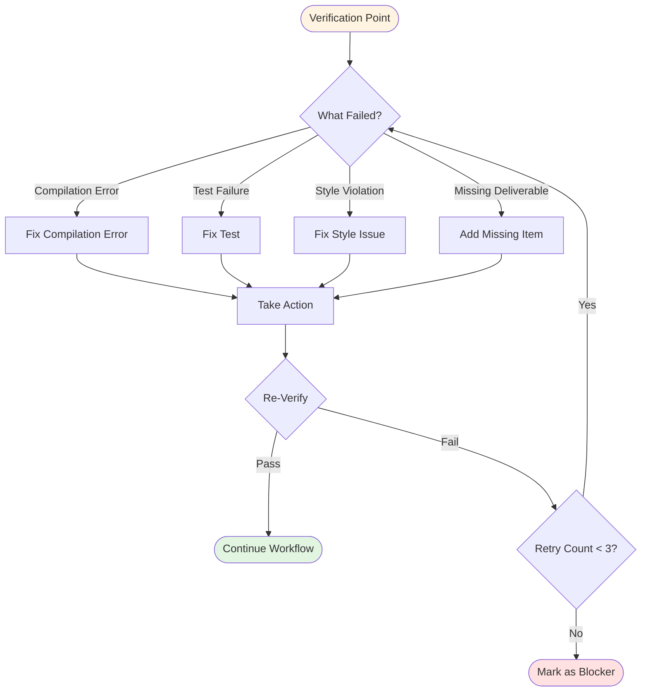
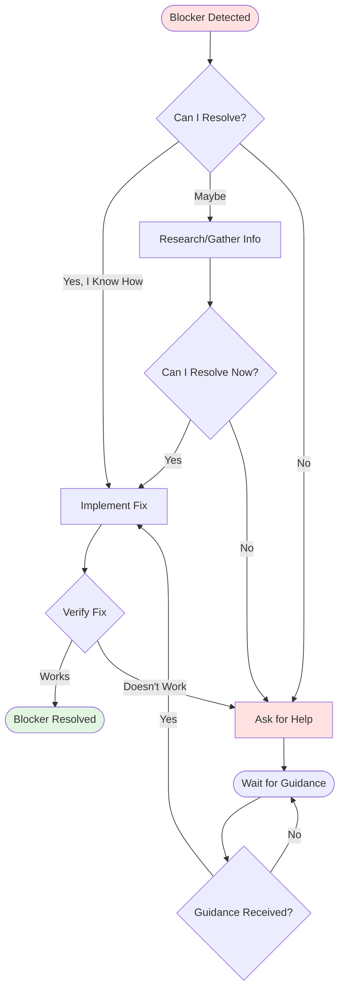

# BHXH Backend - Detailed Development Workflow

## Table of Contents
- [1. Workflow Overview Table](#1-workflow-overview-table)
- [2. Workflow Flow Diagram](#2-workflow-flow-diagram)
- [3. Quick Reference Summary](#3-quick-reference-summary)
- [4. Detailed Workflow](#4-detailed-workflow)
- [5. Universal Rules](#5-universal-rules)
- [6. Decision Trees & Workflows](#6-decision-trees--workflows)
- [7. References](#7-references)

---

## 1. Workflow Overview Table

| Phase | Name | Purpose | Input | Output | Success Criteria |
|-------|------|---------|-------|--------|------------------|
| 1 | Brainstorming | Understand requirements & design solution | Project Context, User requirements | Design proposal | Stakeholder approval achieved |
| 2 | Acceptance Criteria | Define testable requirements | Design proposal | Checklist QC document | All 11 sections complete |
| 3 | PAKT | Define technical solution | Checklist QC | PAKT document | Technical review passed |
| 4 | Task Breaking | Breakdown for AI execution | PAKT document | Task solution files | All tasks defined with templates |
| 5 | AI Generate Code | Implement solution | Task files | Source code | All tests pass |
| 6 | Fix & Improve | Quality assurance | Source code | Clean, tested code | Lint and typecheck pass |
| 7 | Update Docs | Finalize documentation | All artifacts | Updated PAKT, Checklist | Documentation complete |

---

## 2. Workflow Flow Diagram

```
                                ┌─────────────────────────────┐
                                │     Start Development       │
                                │  Input: Requirements,       │
                                │         Context             │
                                └──────────────┬──────────────┘
                                               │
                                               ▼
                                ┌─────────────────────────────┐
                                │   Phase 1: Brainstorming    │
                                ├─────────────────────────────┤
                                │ • Read Project Context      │
                                │ • Use Brainstorming Skill   │
                                │ • Clarify requirements      │
                                │ • Validate understanding    │
                                │ • Present design            │
                                ├─────────────────────────────┤
                                │ Output: Design Proposal     │
                                └──────────────┬──────────────┘
                                               │
                                    ┌──────────┴──────────┐
                                    │ Design Approved?    │
                                    └──────────┬──────────┘
                              ┌───────────┴───────────┐
                              │ YES                   │ NO
                              ▼                       ▼
                    ┌───────────────────┐    ┌──────────────────┐
                    │  Phase 2:         │    │  Return to       │
                    │  Acceptance       │    │  Phase 1         │
                    │  Criteria         │    └──────────────────┘
                    ├───────────────────┤
                    │ • Read Checklist  │
                    │   Rule            │
                    │ • Create 11       │
                    │   sections        │
                    │ • Verify          │
                    │   completeness    │
                    │ • Quality check   │
                    ├───────────────────┤
                    │ Output:           │
                    │ checklist_qc.md   │
                    └─────────┬─────────┘
                              │
                       ┌──────┴──────┐
                       │ All 11      |
                       | sections    │
                       │ Complete?   │
                       └──────┬──────┘
                 ┌──────────────┴──────────────┐
                 │ YES                         │ NO
                 ▼                             ▼
       ┌──────────────────┐         ┌──────────────────┐
       │  Phase 3:        │         │  Return to       │
       │  PAKT            │         │  Phase 2         │
       ├──────────────────┤         └──────────────────┘
       │ • Read PAKT Rule │
       │ • Create 10      │
       │   sections       │
       │ • Map checklist  │
       │ • Define arch/   │
       │   API/data       │
       ├──────────────────┤
       │ Output:          │
       │ pakt_{feature}.md│
       └─────────┬────────┘
                 │
          ┌──────┴──────┐
          │ Technical   │
          │ Review      │
          │ Pass?       │
          └──────┬──────┘
    ┌────────────┴──────────────┐
    │ YES                       │ NO
    ▼                           ▼
  ┌──────────────────┐    ┌──────────────────┐
  │  Phase 4:        │    │  Return to       │
  │  Task Breaking   │    │  Phase 3         │
  ├──────────────────┤    └──────────────────┘
  │ • Read Tasks     │
  │   Rule           │
  │ • Analyze PAKT   │
  │ • Create task    │ 
  │   files          │
  │ • Add code       │
  │   references     │
  ├──────────────────┤
  │ Output:          │
  │ task_{XX}.md     │
  └─────────┬────────┘
            │
     ┌──────┴──────┐
     │ All Tasks   │
     │ Defined?    │
     └──────┬──────┘
   ┌────────┴────────────────────┐
   │ YES                         │ NO
   ▼                             ▼
 ┌──────────────────┐    ┌──────────────────┐
 │  Phase 5:        │    │  Return to       │
 │  AI Generate     │    │  Phase 4         │
 │  Code            │    └──────────────────┘
 ├──────────────────┤
 │ • Read Executing │
 │   Plans Skill    │
 │ • Load tasks     │
 │ • Execute batches│
 │ • Verify each    │
 ├──────────────────┤
 │ Output:          │
 │ Source Code      │
 └─────────┬────────┘
           │
    ┌──────┴──────┐
    │ Blocked?    │
    └──────┬──────┘
  ┌────────┴────────────────────┐
  │ NO                          │ YES
  ▼                             ▼
┌──────────────────┐    ┌──────────────────┐
│  Phase 6:        │    │  Can Resolve?    │
│  Fix & Improve   │    └────────┬─────────┘
├──────────────────┤    ┌────────┴────────-┐
│ • ./mvnw clean   │    │ YES    │ NO      │
│   compile        │    ▼        ▼         │
│ • ./mvnw test    │  ┌──────┐ ┌──────┐    │
│ • Style check    │  │Return│ │Escal-│    │
│ • Security       │  │to P5 │ │ate   │    │
├──────────────────┤  └──────┘ └──────┘    │
│ Output: Clean    │                       │
│   Tested Code    │                       │
└─────────┬────────┘                       │
          │                                │
   ┌──────┴──────┐                         │
   │ All Checks  │                         │
   │ Pass?       │                         │
   └──────┬──────┘                         │
 ┌────────┴────────────────────┐           │
 │ YES                         │ NO        │
 ▼                             │           │ 
┌──────────────────┐           │           │
│  Phase 7:        │           │           │
│  Update Docs     │           │           │
├──────────────────┤           │           │
│ • Update PAKT    │           │           │
│ • Update         │           │           │
│   Checklist      │           │           │
│ • Summary report │           │           │
├──────────────────┤           │           │
│ Output: Complete │           │           │
│   Documentation  │           │           │
└─────────┬────────┘           │           │
          │                    │           │
          │                    └───────────┘
          ▼
   ┌──────────────────┐
   │ ✅ Feature       │
   │    Complete      │
   │ • Code compiles  │
   │ • Tests pass     │
   │ • Docs updated   │
   └──────────────────┘
```

---

## 3. Quick Reference Summary

### Phase 1: Brainstorming
**Description**: Understand requirements deeply and design a solution that meets stakeholder needs.
- Read [Project Context](../context/context.md) to understand system architecture
- Review [AGENTS.md](../AGENTS.md) for code style guidelines
- Use [Brainstorming Skill](../.agent/skills/brainstorming/SKILL.md)
- Clarify requirements (edge cases, permissions, integrations, data model, state transitions)
- Validate understanding with stakeholders
- Present initial design proposal

**Key Output**: Design proposal approved by stakeholders

---

### Phase 2: Acceptance Criteria Checklist
**Description**: Create comprehensive, testable requirements covering all scenarios.
- Read [Create Checklist Rule](rule_create_checklist.md)
- Create `docs/tasks/checklist_qc_{app|portal}_{featurename}.md`
- Complete all 11 sections:
  - Happy Paths (100% coverage)
  - Common Scenarios (50-70% coverage)
  - Validations
  - Business Rules
  - State Management
  - Error Handling
  - Edge Cases
  - Permissions
  - External Integrations
  - Non-Functional Requirements
  - Definition of Done
- Verify completeness and quality

**Key Output**: `checklist_qc_{app|portal}_{feature}.md` with 11 sections complete

---

### Phase 3: PAKT - Technical Solution
**Description**: Define comprehensive technical solution covering all aspects of implementation.
- Read [Create PAKT Rule](rule_create_pakt.md)
- Create `pakt/pakt_{app|portal}_{featurename}.md`
- Complete all 10 sections:
  - Scope
  - Mapping Checklist to Solution
  - Architecture
  - API Design
  - Data Model
  - Business Logic
  - Integration
  - Security
  - Impact Analysis
  - Implementation Notes
- Map all checklist items to technical approach
- Follow code style from [AGENTS.md](../AGENTS.md)
- **Critical**: FK to `dm_*` tables must reference `ma` column, NOT `id`

**Key Output**: `pakt_{app|portal}_{feature}.md` with 10 sections complete

---

### Phase 4: Task Breaking
**Description**: Break PAKT into executable tasks for AI code generation.
- Read [Break Tasks from PAKT Rule](rule_break_tasks_from_pakt.md)
- Analyze PAKT to identify work packages
- Create task files: `pakt/{feature}/task_{XX}_{name}_solution.md`
- Define tasks:
  - **Task 00**: Data Model (entities, repositories, FK mappings with `referencedColumnName = "ma"`)
  - **Task 01+**: API Layer (controllers, DTOs, MapStruct, `@PreAuthorize`)
  - **Task 02+**: Business Logic (services, state machine, events, `@Transactional`)
  - **Task 03+**: Integration (WebClient, external APIs, timeout/retry)
- Add code references from existing codebase
- Document task dependencies

**Key Output**: `task_{XX}_{name}_solution.md` files with code references

---

### Phase 5: AI Generate Code
**Description**: Execute tasks and generate production code.
- Read [Executing Plans Skill](../.agent/skills/executing-plans/SKILL.md)
- Load all task plans from `pakt/{feature}/`
- Execute tasks in batches of 3
- Verify after each batch:
  - Run `./mvnw clean compile`
  - Check code follows [AGENTS.md](../AGENTS.md) guidelines
  - Verify all deliverables present
- Handle verification failures (fix, re-verify)
- Handle blockers (attempt resolution, escalate if needed)

**Key Output**: Source code implementation that compiles

---

### Phase 6: Fix & Improve
**Description**: Ensure code quality, fix issues, verify correctness.
- Run compilation: `./mvnw clean compile`
- Run tests: `./mvnw test` (if tests exist)
- Code style check against [AGENTS.md](../AGENTS.md):
  - Import organization (Java stdlib → Third-party → Project)
  - Naming conventions (PascalCase classes, camelCase methods, Vietnamese for business logic)
  - Lombok annotations (DTOs: `@Data`, Entities: `@Getter/@Setter`, Services: `@RequiredArgsConstructor @Slf4j`)
  - Entity mapping (`@Table`, `@Column` with snake_case, FK to `dm_*` uses `referencedColumnName = "ma"`)
  - API layer (CMS: `/api/v1/**` with `@PreAuthorize`, App: `/api/app/v1/**` with `@authenticated`)
  - Error handling (`BusinessException` with `MessageResponseDict`)
  - Logging (`@Slf4j`, format: `log.info("Action: id={}, status={}", id, status)`)
- Code quality review (transactions, validation, null safety, error handling)
- Security review (permissions, authentication, SQL injection, secrets)
- Final build verification

**Key Output**: Clean, tested code that compiles and passes all checks

---

### Phase 7: Update Final Documents
**Description**: Complete documentation with implementation status and verification results.
- Update PAKT document with implementation status:
  - Mark sections: ✅ Implemented, ⚠️ Partial, ❌ Not implemented
  - Document deviations from original plan
  - Add technical decisions made
- Update Checklist document with verification results:
  - Mark criteria: ✅ Pass, ⚠️ Partial, ❌ Fail, N/A
  - Add verification evidence (test cases, manual testing, code review)
  - Document gaps or known issues
- Create summary report (feature summary, status, results, issues, recommendations)
- Final review (completeness, consistency, no TODOs remaining)

**Key Output**: Complete documentation package (updated PAKT, Checklist, summary)

---

## 4. Detailed Workflow

### Phase 1: Brainstorming

**Purpose**: Understand requirements deeply and design a solution that meets stakeholder needs.

**Prerequisites**: None (starting point)

**Inputs**:
- [Project Context](../context/context.md)
- User requirement documents
- Any existing feature specifications

**Outputs**:
- Design proposal document
- List of clarified requirements
- Initial scope definition

**Detailed Steps**:

1. **Initialize Context**
   - Read [Project Context](../context/context.md) to understand system architecture
   - Review [AGENTS.md](../AGENTS.md) for code style guidelines
   - Identify related features and existing patterns

2. **Understand Idea**
   - Use [Brainstorming Skill](../.agent/skills/brainstorming/SKILL.md)
   - Read user requirement documents carefully
   - Identify core business requirements
   - List all entities, relationships, and workflows

3. **Clarify Requirements**
   - Identify ambiguities in requirements
   - Ask questions about:
     - Edge cases and error scenarios
     - Permission requirements (CMS vs App)
     - External integrations needed
     - Data model relationships
     - State transitions if applicable
   - Document all clarifications received

4. **Validate Understanding**
   - Summarize understanding back to stakeholders
   - Confirm business rules and constraints
   - Verify scope boundaries (what's in/out)
   - Get confirmation on critical decisions

5. **Present Design**
   - Present initial design proposal
   - Include:
     - High-level architecture
     - Key components and their responsibilities
     - Data model overview
     - API endpoint proposals
     - Integration points
   - Address concerns and iterate

**Success Criteria**:
- [ ] Stakeholder approves design proposal
- [ ] All critical questions answered
- [ ] Scope boundaries clearly defined
- [ ] Business rules documented
- [ ] No major ambiguities remaining

**Related Rules**:
- [Brainstorming Skill](../.agent/skills/brainstorming/SKILL.md)
- [Code Style Guidelines](../AGENTS.md)

**Common Pitfalls**:
- ❌ Skipping clarification and making assumptions
- ❌ Not checking existing patterns in codebase
- ❌ Designing without considering permissions (CMS vs App)
- ❌ Forgetting to ask about external integrations

---

### Phase 2: Acceptance Criteria Checklist

**Purpose**: Create comprehensive, testable requirements covering all scenarios.

**Prerequisites**: Phase 1 complete (design approved)

**Inputs**:
- Approved design proposal
- [Create Checklist Rule](rule_create_checklist.md)

**Outputs**:
- `docs/tasks/checklist_qc_{app|portal}_{featurename}.md`

**Detailed Steps**:

1. **Read Create Checklist Rule**
   - Study [rule_create_checklist.md](rule_create_checklist.md)
   - Understand the 11-section structure
   - Review examples if available

2. **Create Checklist Document**
   - Create file: `docs/tasks/checklist_qc_{app|portal}_{featurename}.md`
   - Complete all 11 sections:
     
     **Section 1: Happy Paths - 100% Coverage**
     - Main success scenarios
     - All permutations of valid inputs
     - Complete user journeys
     
     **Section 2: Common Scenarios - 50-70% Coverage**
     - Typical user behaviors
     - Most frequent use cases
     - Expected partial failures
     
     **Section 3: Validations**
     - Input field validations
     - Business rule validations
     - Permission checks
     
     **Section 4: Business Rules**
     - Calculations and formulas
     - State transition rules
     - Constraints and invariants
     
     **Section 5: State Management**
     - Initial states
     - State transitions (if applicable)
     - State queries
     
     **Section 6: Error Handling**
     - Expected error scenarios
     - Error codes and messages
     - Recovery behaviors
     
     **Section 7: Edge Cases**
     - Boundary conditions
     - Empty/Null scenarios
     - Concurrent operations
     
     **Section 8: Permissions**
     - CMS permission requirements
     - App authentication requirements
     - Cross-user access rules
     
     **Section 9: External Integrations**
     - External API calls
     - Timeout scenarios
     - Retry behaviors
     
     **Section 10: Non-Functional**
     - Performance requirements
     - Caching strategy
     - Logging requirements
     
     **Section 11: Definition of Done**
     - Code complete
     - Tests passing
     - Documentation updated
     - Code review complete

3. **Verify Completeness**
   - Check all sections filled
   - Ensure happy paths cover 100%
   - Ensure common scenarios cover 50-70%
   - Verify all error codes defined

4. **Quality Check**
   - Review for clarity
   - Ensure testability (each criterion is verifiable)
   - Check traceability to requirements

**Success Criteria**:
- [ ] All 11 sections complete
- [ ] Happy paths documented with 100% coverage
- [ ] Common scenarios documented (50-70% coverage)
- [ ] Every criterion is testable
- [ ] Error codes defined
- [ ] DoD clearly defined
- [ ] No missing critical scenarios

**Related Rules**:
- [Create Checklist Rule](rule_create_checklist.md)

**Common Pitfalls**:
- ❌ Missing edge cases (null checks, empty lists)
- ❌ Forgetting permission scenarios
- ❌ Untestable criteria (e.g., "user-friendly" without specifics)
- ❌ Skipping error scenarios
- ❌ Not covering state transitions for workflows

---

### Phase 3: PAKT - Technical Solution

**Purpose**: Define comprehensive technical solution covering all aspects of implementation.

**Prerequisites**: Phase 2 complete (checklist approved)

**Inputs**:
- Approved checklist document
- [Create PAKT Rule](rule_create_pakt.md)
- Existing codebase for reference

**Outputs**:
- `pakt/pakt_{app|portal}_{featurename}.md`

**Detailed Steps**:

1. **Read Create PAKT Rule**
   - Study [rule_create_pakt.md](rule_create_pakt.md)
   - Understand 10-section structure
   - Review PAKT examples in codebase

2. **Create PAKT Document**
   - Create file: `pakt/pakt_{app|portal}_{featurename}.md`
   - Complete all 10 sections:
     
     **Section 1: Scope**
     - Feature description
     - In-scope items
     - Out-of-scope items
     - Assumptions
     
     **Section 2: Mapping Checklist to Solution**
     - Map each checklist item to technical approach
     - Reference acceptance criteria IDs
     - Ensure all checklist items covered
     
     **Section 3: Architecture**
     - Component diagram
     - Layer breakdown (Controller → Service → Repository)
     - Key classes and their responsibilities
     - Design patterns used
     
     **Section 4: API Design**
     - Endpoint definitions (CMS: `/api/v1/**`, App: `/api/app/v1/**`)
     - Request/Response DTOs
     - HTTP methods and status codes
     - Swagger annotations
     
     **Section 5: Data Model**
     - Entity definitions with JPA annotations
     - Table relationships (OneToOne, OneToMany, ManyToOne)
     - Foreign key mappings (note: `dm_*` tables use `ma`, not `id`)
     - Indexes and constraints
     
     **Section 6: Business Logic**
     - Service layer methods
     - Algorithms and calculations
     - State machine usage (if applicable)
     - Event publishing for audit
     
     **Section 7: Integration**
     - External API calls (WebClient)
     - Timeout and retry configurations
     - Error handling for external calls
     - Data transformation logic
     
     **Section 8: Security**
     - Permission annotations (`@PreAuthorize`)
     - Authentication requirements
     - Input validation
     - Sensitive data handling
     
     **Section 9: Impact Analysis**
     - Breaking changes
     - Database migrations needed
     - Performance considerations
     - Dependent features affected
     
     **Section 10: Implementation Notes**
     - Batch size for bulk operations (500-600)
     - Caching strategy (Redis, TTL 60min)
     - Transaction boundaries
     - Special considerations

3. **Verify Completeness**
   - Ensure all checklist items mapped
   - Check all scenarios have pseudocode
   - Verify no implementation details (keep it abstract)
   - Review for consistency with codebase patterns

**Success Criteria**:
- [ ] All 10 sections complete
- [ ] Every checklist item mapped to solution
- [ ] Pseudocode only (no actual implementation)
- [ ] Architecture follows existing patterns
- [ ] All scenarios covered
- [ ] Security considerations documented
- [ ] Database FKs correctly reference `ma` column for `dm_*` tables

**Related Rules**:
- [Create PAKT Rule](rule_create_pakt.md)
- [Code Style Guidelines](../AGENTS.md)

**Common Pitfalls**:
- ❌ Writing implementation code instead of pseudocode
- ❌ Forgetting to map checklist items
- ❌ Incorrect FK references (using `id` instead of `ma` for `dm_*` tables)
- ❌ Missing permission annotations
- ❌ Not considering transaction boundaries
- ❌ Forgetting external API timeout/retry handling

---

### Phase 4: Task Breaking

**Purpose**: Break PAKT into executable tasks for AI code generation.

**Prerequisites**: Phase 3 complete (PAKT approved)

**Inputs**:
- Approved PAKT document
- [Break Tasks from PAKT Rule](rule_break_tasks_from_pakt.md)

**Outputs**:
- `pakt/{feature}/task_00_{name}_solution.md`
- `pakt/{feature}/task_01_{name}_solution.md`
- `pakt/{feature}/task_02_{name}_solution.md`
- Additional task files as needed

**Detailed Steps**:

1. **Read Break Tasks Rule**
   - Study [rule_break_tasks_from_pakt.md](rule_break_tasks_from_pakt.md)
   - Understand task structure and templates
   - Review existing task examples

2. **Analyze PAKT**
   - Identify distinct work packages:
     - Data model (entities, repositories)
     - API layer (controllers, DTOs)
     - Business logic (services, helpers)
     - Integration (external APIs)
   - Estimate effort for each package

3. **Create Task Files**
   - Create directory: `pakt/{feature}/`
   - Create task files following pattern: `task_{XX}_{name}_solution.md`
    
    **Task 00: Data Model**
    - Entities with JPA annotations
    - Repository interfaces
    - Entity relationships
    - FK mappings (use `referencedColumnName = "ma"` for `dm_*`)
    - Audit fields (`@CreatedDate`, `@LastModifiedDate`)
    
    **Task 01+: API Layer**
    - Controller classes
    - Request/Response DTOs
    - Swagger annotations
    - Permission checks (`@PreAuthorize`)
    - Validation annotations
    - MapStruct mappers
    
    **Task 02+: Business Logic**
    - Service classes
    - Business methods
    - State machine usage
    - Event publishing
    - Transaction boundaries
    - Error handling
    
    **Task 03+: Integration**
    - WebClient configurations
    - External API calls
    - Timeout/retry logic
    - Response parsing
    - Error handling for external calls

4. **Add Code References**
   - For each task, add reference code examples from codebase
   - Show similar implementations
   - Include import statements
   - Add annotation patterns

5. **Verify Task Completeness**
   - Ensure all PAKT sections covered by tasks
   - Check task dependencies defined
   - Verify estimated times are reasonable
   - Confirm code references are accurate

**Success Criteria**:
- [ ] All tasks defined with clear deliverables
- [ ] Task 00 (Data Model) always included
- [ ] Code references provided for patterns
- [ ] Task dependencies documented

**Related Rules**:
- [Break Tasks from PAKT Rule](rule_break_tasks_from_pakt.md)

**Common Pitfalls**:
- ❌ Making tasks too large (>16 hours)
- ❌ Forgetting Task 00 for data model
- ❌ Not providing code references
- ❌ Missing FK mapping examples for `dm_*` tables
- ❌ Not defining task dependencies
- ❌ Skipping permission check examples

---

### Phase 5: AI Generate Code

**Purpose**: Execute tasks and generate production code.

**Prerequisites**: Phase 4 complete (all tasks defined)

**Inputs**:
- All task solution files
- [Executing Plans Skill](../.agent/skills/executing-plans/SKILL.md)

**Outputs**:
- Source code files
- Compiled application
- Test results

**Detailed Steps**:

1. **Read Executing Plans Skill**
   - Study [Executing Plans Skill](../.agent/skills/executing-plans/SKILL.md)
   - Understand batch execution approach
   - Learn verification and reporting process

2. **Load Task Plans**
   - Load all task files from `pakt/{feature}/`
   - Understand task dependencies
   - Plan execution order (respect dependencies)

3. **Execute Tasks in Batches**
   - Process tasks in batches of 3
   - For each batch:
     a. Load task plans
     b. Execute task (generate code)
     c. Verify output:
        - Code compiles: `./mvnw clean compile`
        - Code follows style guidelines
        - All deliverables present
     d. Report progress
     e. Continue to next task
   
4. **Handle Verification Failures**
   - If verification fails:
     - Identify root cause
     - Fix the issue
     - Re-verify
     - If cannot resolve, note as blocker
    
5. **Handle Blockers**
   - If blocked:
     - Document blocker details
     - Attempt resolution
     - If unresolvable, ask for help
     - Do not proceed until resolved

6. **Final Verification**
   - Run: `./mvnw clean compile`
   - Verify all tasks completed
   - Check all deliverables present
   - Verify code quality

**Success Criteria**:
- [ ] All tasks completed
- [ ] Code compiles without errors
- [ ] All deliverables present
- [ ] Code follows AGENTS.md guidelines
- [ ] No unresolved blockers

**Related Rules**:
- [Executing Plans Skill](../.agent/skills/executing-plans/SKILL.md)
- [Code Style Guidelines](../AGENTS.md)
- [Universal Rules](#5-universal-rules)

**Common Pitfalls**:
- ❌ Skipping verification after each task
- ❌ Not running compile until all tasks done
- ❌ Ignoring blockers and continuing
- ❌ Not following code style guidelines
- ❌ Generating tests when none exist in project
- ❌ Using FK mappings incorrectly (referencing `id` instead of `ma`)

---

### Phase 6: Fix & Improve

**Purpose**: Ensure code quality, fix issues, verify correctness.

**Prerequisites**: Phase 5 complete (all code generated)

**Inputs**:
- Generated source code
- [Code Style Guidelines](../AGENTS.md)

**Outputs**:
- Clean, compiled code
- Passing tests (if applicable)
- Issues resolved

**Detailed Steps**:

1. **Run Compilation**
   - Execute: `./mvnw clean compile`
   - Fix any compilation errors
   - Ensure all dependencies resolved

2. **Run Tests**
   - Execute: `./mvnw test`
   - If tests exist:
     - Fix failing tests
     - Ensure all tests pass
   - If no tests exist (common in this project):
     - Note in documentation
     - Prioritize adding tests for new features

3. **Code Style Check**
   - Review code against [AGENTS.md](../AGENTS.md):
     
     **Import Organization**
     - Group: Java stdlib → Third-party → Project
     - No wildcard imports (except static)
     
     **Naming Conventions**
     - Classes: PascalCase
     - Methods: camelCase, Vietnamese for business logic
     - Variables: camelCase
     - Constants: UPPER_SNAKE_CASE
     
     **Lombok Annotations**
     - DTOs: `@Data @Builder @NoArgsConstructor @AllArgsConstructor`
     - Entities: `@Getter @Setter @NoArgsConstructor @AllArgsConstructor @Builder`
     - Services: `@RequiredArgsConstructor @Slf4j`
     
     **Entity Mapping**
     - `@Table(name = "snake_case")`
     - `@Column(name = "snake_case")`
     - FK to `dm_*`: `referencedColumnName = "ma"`
     - Audit listeners
     
     **API Layer**
     - CMS: `/api/v1/**` with `@PreAuthorize`
     - App: `/api/app/v1/**` with `@authenticated` only
     - Swagger annotations
     
     **Error Handling**
     - `BusinessException` with `MessageResponseDict`
     - Proper HTTP status codes
     
     **Logging**
     - `@Slf4j`
     - Format: `log.info("Action: id={}, status={}", id, status)`

4. **Code Quality Review**
   - Check for:
     - Proper transaction usage (`@Transactional` for writes)
     - Input validation
     - Null safety
     - Error handling completeness
     - Logging at appropriate levels
     - No hardcoded values
     - Proper exception messages

5. **Security Review**
   - Verify:
     - All CMS endpoints have `@PreAuthorize`
     - App endpoints use `getCurrentUserRequired()`
     - No SQL injection vulnerabilities
     - No exposed secrets
     - Proper authentication checks

6. **Final Build Verification**
   - Run: `./mvnw clean compile`
   - Run: `./mvnw test` (if tests exist)
   - Verify no warnings (except expected ones)
   - Confirm application starts successfully

**Success Criteria**:
- [ ] Code compiles without errors
- [ ] All tests pass (if tests exist)
- [ ] Code follows AGENTS.md conventions
- [ ] No security vulnerabilities
- [ ] Proper error handling in place
- [ ] Logging implemented correctly
- [ ] Transactions properly configured

**Related Rules**:
- [Code Style Guidelines](../AGENTS.md)
- [Universal Rules](#5-universal-rules)

**Common Pitfalls**:
- ❌ Not checking FK mappings to `dm_*` tables
- ❌ Missing `@PreAuthorize` on CMS endpoints
- ❌ Using `id` instead of `ma` for category table FKs
- ❌ Forgetting `@Transactional` on write operations
- ❌ Inconsistent logging format
- ❌ Not validating all inputs
- ❌ Exposing stack traces in error responses

---

### Phase 7: Update Final Documents

**Purpose**: Complete documentation with implementation status and verification results.

**Prerequisites**: Phase 6 complete (code quality verified)

**Inputs**:
- PAKT document
- Checklist document
- Implemented code
- Test results

**Outputs**:
- Updated PAKT with implementation status
- Updated Checklist with verification results
- Complete documentation package

**Detailed Steps**:

1. **Update PAKT Document**
   - Add implementation status section
   - Mark each section as:
     - ✅ Implemented
     - ⚠️ Partially implemented (with notes)
     - ❌ Not implemented (with reason)
   - Add any deviations from original plan
   - Document technical decisions made during implementation

2. **Update Checklist Document**
   - Mark each acceptance criterion as:
     - ✅ Pass
     - ⚠️ Partial pass (with notes)
     - ❌ Fail (with reason)
     - N/A Not applicable
   - Add verification evidence:
     - Test cases written
     - Manual testing performed
     - Code review notes
   - Document any gaps or known issues

3. **Create Summary Report**
   - Feature summary
   - Implementation status
   - Test results
   - Known issues
   - Next steps or recommendations

4. **Final Review**
   - Verify all documents complete
   - Check consistency across documents
   - Ensure all sections filled
   - Verify no TODO items remaining

**Success Criteria**:
- [ ] PAKT updated with implementation status
- [ ] Checklist updated with verification results
- [ ] All acceptance criteria marked
- [ ] Deviations documented
- [ ] Known issues documented
- [ ] Documentation package complete

**Related Rules**:
- [Create PAKT Rule](rule_create_pakt.md)
- [Create Checklist Rule](rule_create_checklist.md)

**Common Pitfalls**:
- ❌ Not updating documents after implementation changes
- ❌ Forgetting to document deviations
- ❌ Not marking all acceptance criteria
- ❌ Missing verification evidence
- ❌ Incomplete status documentation

---

## 5. Universal Rules

### 5.1 Database Rules

| Rule | Description | Applies to Phases |
|------|-------------|-------------------|
| **No Schema Changes Without Approval** | Do not modify database schema without explicit approval | 3, 4, 5 |
| **snake_case Naming** | Tables and columns use snake_case | 3, 4, 5 |
| **FK Reference ma for dm_* Tables** | Category tables use `ma` column as identifier, NOT `id` | 3, 4, 5 |
| **referencedColumnName = "ma"** | Always specify when joining to `dm_*` tables | 4, 5 |
| **FK Reference ma_dbhc for DM_DON_VI_HANH_CHINH** | Use `ma_dbhc` for admin unit references | 3, 4, 5 |
| **BigDecimal for Money** | Always use BigDecimal for monetary values | 3, 4, 5 |
| **LocalDate/LocalDateTime for Dates** | Use java.time types, not Date | 3, 4, 5 |
| **@Column for Mappings** | Explicitly map columns with snake_case | 4, 5 |

**Critical Example - Correct FK Mapping**:
```java
// ❌ WRONG - references id
@ManyToOne
@JoinColumn(name = "ma_co_quan_bhxh")
private DmCoQuanBhxh coQuanBhxh;

// ✅ CORRECT - references ma
@ManyToOne
@JoinColumn(name = "ma_co_quan_bhxh", referencedColumnName = "ma")
private DmCoQuanBhxh coQuanBhxh;
```

### 5.2 Code Style Rules

| Rule | Description | Applies to Phases |
|------|-------------|-------------------|
| **Import Grouping** | Java stdlib → Third-party → Project | 5, 6 |
| **No Wildcard Imports** | Except static imports | 5, 6 |
| **PascalCase Classes** | Classes use PascalCase | 5, 6 |
| **camelCase Methods** | Methods use camelCase, Vietnamese for business logic | 5, 6 |
| **UPPER_SNAKE_CASE Constants** | Constants use UPPER_SNAKE_CASE | 5, 6 |
| **Lombok @Data for DTOs** | DTOs: `@Data @Builder @NoArgsConstructor @AllArgsConstructor` | 4, 5 |
| **Lombok @Getter/@Setter for Entities** | Entities: `@Getter @Setter @NoArgsConstructor @AllArgsConstructor @Builder` | 4, 5 |
| **@RequiredArgsConstructor for Services** | Services: `@RequiredArgsConstructor @Slf4j` | 4, 5 |
| **@UtilityClass for Utils** | Utility classes: `@UtilityClass` | 4, 5 |

### 5.3 Security Rules

| Rule | Description | Applies to Phases |
|------|-------------|-------------------|
| **@PreAuthorize for CMS** | All CMS endpoints must have permission checks | 3, 5, 6 |
| **CMS API Path** | CMS APIs use `/api/v1/**` | 3, 5 |
| **@authenticated for App** | App APIs only require authentication | 3, 5 |
| **App API Path** | App APIs use `/api/app/v1/**` | 3, 5 |
| **getCurrentUserRequired() for App Auth** | Get current user in app controllers | 5, 6 |
| **PermissionChecker Usage** | Use `@permissionChecker.hasPermission()` pattern | 3, 5 |
| **Input Validation** | Use Jakarta validation annotations | 3, 5, 6 |
| **No Secret Logging** | Never log secrets or credentials | 5, 6 |

**Permission Check Pattern**:
```java
// CMS Endpoint
@PreAuthorize("@permissionChecker.hasPermission(authentication, @permissions.BHXH_XEM_HO_SO)")
public ResponseEntity<ApiResponse<HoSoResponse>> getHoSo(@PathVariable Long id) { ... }

// App Endpoint
@Authenticated
public ResponseEntity<ApiResponse<HoSoResponse>> getMyHoSo() {
    Long userId = getCurrentUserRequired().getId();
    // ...
}
```

### 5.4 Error Handling Rules

| Rule | Description | Applies to Phases |
|------|-------------|-------------------|
| **BusinessException** | Throw for business logic errors | 5, 6 |
| **MessageResponseDict** | Use defined error codes | 5, 6 |
| **Error Codes 100000-400000** | Use this range for feature errors | 3, 5 |
| **Global Exception Handling** | Use ExceptionController | 5, 6 |
| **Jakarta Validation** | Use `@NotNull`, `@Valid`, custom messages | 3, 5 |
| **No Stack Traces in API** | Never return stack traces to client | 5, 6 |

**Error Handling Pattern**:
```java
if (hoSo == null) {
    throw new BusinessException(MessageResponseDict.HO_SO_NOT_FOUND);
}
```

### 5.5 Transaction Rules

| Rule | Description | Applies to Phases |
|------|-------------|-------------------|
| **@Transactional for Writes** | All data modification operations | 5, 6 |
| **Read-Only for Queries** | Use `@Transactional(readOnly = true)` | 5, 6 |
| **Batch Size 500-600** | For bulk operations | 3, 5, 6 |
| **saveAll() for Bulk** | Use saveAll() for multiple records | 5, 6 |
| **Event Publishing** | Publish events after state changes | 5, 6 |

### 5.6 Logging Rules

| Rule | Description | Applies to Phases |
|------|-------------|-------------------|
| **@Slf4j Annotation** | Use Lombok's @Slf4j | 4, 5, 6 |
| **Log Format** | `log.info("Action: id={}, status={}", id, status)` | 5, 6 |
| **Info Level** | Business events | 5, 6 |
| **Debug Level** | Detailed information | 5, 6 |
| **Warn Level** | Recoverable issues | 5, 6 |
| **Error Level** | Exceptions only | 5, 6 |
| **No Secret Logging** | Never log passwords, tokens, etc. | 5, 6 |

### 5.7 Build & Test Rules

| Rule | Description | Applies to Phases |
|------|-------------|-------------------|
| **clean compile First** | Always run `./mvnw clean compile` | 5, 6 |
| **test Second** | Run `./mvnw test` after compile | 5, 6 |
| **No Tests Priority** | If no tests, prioritize adding them | 6, 7 |
| **Lint Before Commit** | Run linting if available | 6 |
| **Typecheck** | Run typecheck if available | 6 |
| **Build Sequence** | compile → test → run | 5, 6 |

### 5.8 Architecture Rules

| Rule | Description | Applies to Phases |
|------|-------------|-------------------|
| **Layer Separation** | Controller → Service → Repository | 3, 4, 5 |
| **MapStruct for Mapping** | Entity ↔ DTO conversion | 3, 4, 5 |
| **Repository Interface** | Extend JpaRepository | 4, 5 |
| **@Query with JPQL** | Use JPQL by default | 4, 5 |
| **nativeQuery for Complex SQL** | Only for complex queries with CTEs | 4, 5 |
| **Projection Interfaces** | Use for list views (avoid N+1) | 4, 5 |
| **ResponseEntity<ApiResponse<T>>** | Standard API response wrapper | 3, 4, 5 |
| **PageResponse<T> for Pagination** | Use for paginated responses | 3, 4, 5 |

### 5.9 State Machine Rules (for Hồ sơ)

| Rule | Description | Applies to Phases |
|------|-------------|-------------------|
| **Use HoSoStateMachine** | Call nextTrangThai(currentStatus, event) | 3, 5, 6 |
| **States** | CHO_THU_TIEN → DA_THU_TIEN → CHO_DUYET_NOI_BO → CHO_NOP_CQ_BHXH → CQ_BHXH_DANG_XU_LY → THANH_CONG/BI_TU_CHOI/DA_HUY | 3, 5 |
| **Events in HoSoEvent** | Define transition triggers | 3, 5 |
| **Event Publishing** | Publish HoSoStatusChangedEvent on changes | 3, 5, 6 |
| **@EventListener** | Handle events for audit logging | 5, 6 |

### 5.10 Caching & Integration Rules

| Rule | Description | Applies to Phases |
|------|-------------|-------------------|
| **Redis Caching** | Use RedisFunction and KeyConst | 3, 5 |
| **Default TTL 60 min** | Cache expiration time | 3, 5 |
| **WebClient for External** | Use WebFlux WebClient | 3, 4, 5 |
| **Timeout Configuration** | Set timeouts in application.yml | 3, 5 |
| **Max Retries** | Configure retry behavior | 3, 5 |
| **Gson for JSON** | Use Gson for parsing | 3, 5 |
| **Error Handling for External** | Handle timeouts and failures | 3, 5, 6 |

---

## 6. Decision Trees & Workflows

### 6.1 Verification Failure Workflow



### 6.2 Block Resolution Workflow



### 6.3 Escalation Path

When encountering blockers:

1. **Before Escalating**:
   - Review relevant rules and documentation
   - Search codebase for similar patterns
   - Attempt solution based on understanding

2. **When to Escalate**:
   - Blocked without progress after multiple attempts
   - Missing critical information
   - Unclear requirements
   - Technical limitation encountered

3. **How to Escalate**:
   - Document the blocker clearly
   - Explain what you've tried
   - Provide relevant context (PAKT, task, error)
   - Ask specific question

4. **After Receiving Guidance**:
   - Implement suggested solution
   - Verify it works
   - Document learning

### 6.4 Quality Gates

Each phase has quality gates that must pass before proceeding:

| Phase | Quality Gates |
|-------|---------------|
| **1. Brainstorming** | Stakeholder approval, no open questions |
| **2. Acceptance Criteria** | All 11 sections complete, all testable |
| **3. PAKT** | All checklist items mapped, pseudocode only |
| **4. Task Breaking** | All tasks defined, code references provided |
| **5. AI Generate Code** | Code compiles, all deliverables present |
| **6. Fix & Improve** | Compile pass, tests pass, style OK |
| **7. Update Docs** | All sections updated, status documented |

### 6.5 Exit Criteria

**Success Exit**: Feature complete when:
- ✅ All 7 phases complete
- ✅ Code compiles without errors
- ✅ All tests pass (if applicable)
- ✅ Code style verified
- ✅ Documentation complete
- ✅ No unresolved blockers

**Failure Exit**: Feature stops when:
- ❌ Blocker cannot be resolved after escalation
- ❌ Requirements cannot be clarified
- ❌ Technical constraint makes implementation impossible
- ❌ Stakeholder cancels feature

---

## 7. References

### 7.1 Skills

| Skill | Location | Used In Phase |
|-------|----------|---------------|
| Brainstorming | [.agent/skills/brainstorming/SKILL.md](../.agent/skills/brainstorming/SKILL.md) | 1 |
| Executing Plans | [.agent/skills/executing-plans/SKILL.md](../.agent/skills/executing-plans/SKILL.md) | 5 |

### 7.2 Rules

| Rule | Location | Used In Phase |
|------|----------|---------------|
| Create Checklist | [rule_create_checklist.md](rule_create_checklist.md) | 2 |
| Create PAKT | [rule_create_pakt.md](rule_create_pakt.md) | 3 |
| Break Tasks from PAKT | [rule_break_tasks_from_pakt.md](rule_break_tasks_from_pakt.md) | 4 |

### 7.3 Documentation

| Document | Location | Purpose |
|----------|----------|---------|
| Project Context | [context/context.md](../context/context.md) | System understanding |
| Code Style Guidelines | [AGENTS.md](../AGENTS.md) | Coding standards |
| Workflow Reference | [prompt/work_flow.md](../prompt/work_flow.md) | Format reference |

### 7.4 Key Code References

When implementing, reference these patterns:

| Pattern | Location | Description |
|---------|----------|-------------|
| Entity Mapping | Search `@ManyToOne` in codebase | FK mapping examples |
| Permission Checks | Search `@PreAuthorize` in codebase | CMS permission patterns |
| App Auth | Search `getCurrentUserRequired()` in codebase | App authentication |
| State Machine | `HoSoStateMachine.java` | State transitions |
| Event Publishing | Search `ApplicationEventPublisher` | Audit logging |
| WebClient Usage | Search `WebClient` in codebase | External API calls |
| Repository Queries | Search `@Query` in codebase | Query patterns |

### 7.5 Build Commands Reference

```bash
# Build project
./mvnw clean package

# Run application (dev)
./mvnw spring-boot:run

# Build without tests
./mvnw clean package -DskipTests

# Run specific test
./mvnw test -Dtest=ClassName

# Run specific test method
./mvnw test -Dtest=ClassName#methodName

# Run with profile
./mvnw spring-boot:run -Dspring-boot.run.profiles=dev

# Compilation check
./mvnw clean compile

# Run tests
./mvnw test
```

---

## Appendix: Quick Reference

### Phase Checklist

- [ ] **Phase 1**: Design approved
- [ ] **Phase 2**: Checklist complete (11 sections)
- [ ] **Phase 3**: PAKT complete (10 sections)
- [ ] **Phase 4**: Tasks defined (all)
- [ ] **Phase 5**: Code generated, compiles
- [ ] **Phase 6**: Tests pass, style verified
- [ ] **Phase 7**: Documentation updated

### Critical Reminders

🚨 **FK to dm_* tables**: Always use `referencedColumnName = "ma"`, NOT `id`

🔒 **Security**: CMS endpoints need `@PreAuthorize`, App endpoints need `@authenticated`

💰 **Money**: Always use `BigDecimal`

📅 **Dates**: Use `LocalDate`/`LocalDateTime`, not `java.util.Date`

🛑 **Transactions**: Use `@Transactional` for write operations

📝 **Logging**: Use `@Slf4j`, format: `log.info("Action: id={}, status={}", id, status)`

🏗️ **Build Sequence**: `./mvnw clean compile` → `./mvnw test` → `./mvnw`

🇻🇳 **Naming**: Vietnamese for business logic methods and messages

---

*End of Document*
